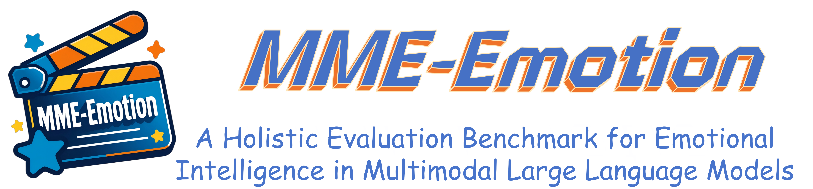
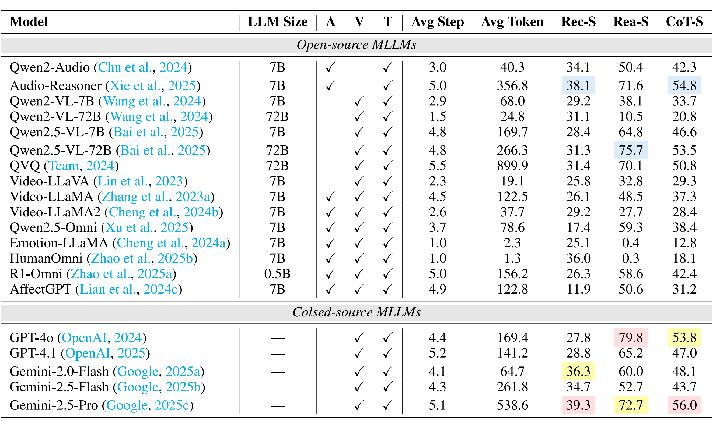
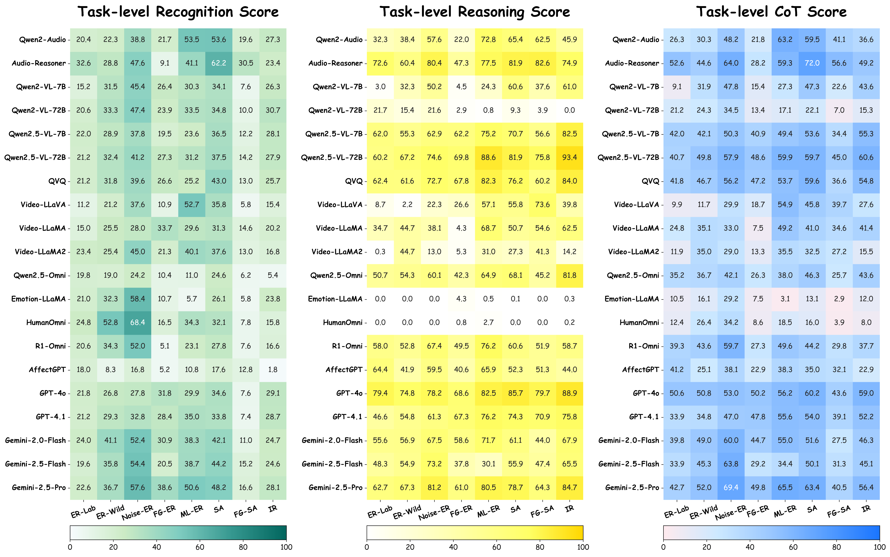

# MME-Emotion: A Holistic Evaluation Benchmark for Emotional Intelligence in Multimodal Large Language Models

 
 
  
 
 
 


<p align="center">
    
</p>


<font size=7><div align='center' > [[🍎 Project Page](https://mme-emotion.github.io/)] [[📖 arXiv Paper](https://www.arxiv.org/pdf/2508.09210)] [[📊 Dataset](https://huggingface.co/datasets/Karl28/MME-Emotion)] [[🏆 Leaderboard](https://mme-emotion.github.io/#leaderboard)]  </div></font>


🌟 Official repository for the paper "MME-Emotion: A Holistic Evaluation Benchmark for Emotional Intelligence in Multimodal Large Language Models"

---

## 💥 News
- **[2026.01]** 🚀 We upload the whole [MME-Emotion dataset](https://huggingface.co/datasets/Karl28/MME-Emotion)!
- **[2025.08]** 🚀 We release the [arXiv paper](https://www.arxiv.org/pdf/2508.09210)!


## 👀 About MME-Emotion

Recent advances in multimodal large language models (MLLMs) have catalyzed transformative progress in affective computing, enabling models to exhibit emergent emotional intelligence. Despite substantial methodological progress, current emotional benchmarks remain limited, as it is still unknown: **(a)** the generalization abilities of MLLMs across distinct scenarios, and **(b)** their reasoning capabilities to identify the triggering factors behind emotional states.
To bridge these gaps, we present MME-Emotion, a systematic benchmark that assesses both emotional understanding and reasoning capabilities of MLLMs, enjoying ***scalable capacity***, ***diverse settings***, and ***unified protocols***. As the largest emotional intelligence benchmark for MLLMs, MME-Emotion contains 6,500 curated video clips with task-specific questioning-answering pairs, spanning broad scenarios to formulate 8 emotional tasks.

<p align="center">
     <br>
</p>

MME-Emotion further incorporates a holistic evaluation suite with three metrics (recognition score, reasoning score, and CoT score) for emotion recognition and reasoning, analyzed through a multi-agent system framework. The validity of our evaluation strategy is also fully verified by five human experts.

<p align="center">
     <br>
</p>

In addition, we systematically evaluate the performance of 20 open-source an closed-source cutting-edge MLLMs on MME-Emotion.


## 🚀 Evaluation

After obtaining the answer from a specific MLLM and pre-extracted audio clues, we can subsequently extract key steps and evaluate the performance.

Extracting Key Steps:
```bash
python ./extract_step/task/code/extract_step.py \
    --input_json "$ MLLM resposne file" \
    --output_json "$ saved step file" 
```


Evaluating Performance:
```bash
python ./eval_cot/task/code/eval_cot_gpt4o.py \
    --video_dir "$ video directory" \
    --audio_json "$ aduio clues file" \
    --response_json "$ saved step file" \
    --output_json "$ saved eval file" 
```

## 💪 Calculating Metrics

After getting GPT-4o's evaluation, we can calculate the metrics.

Calculating Metrics:
```bash
python ./eval_cot/task/metrics/cal_metrics.py \
    --input_json "$ saved eval file" \
    --output_txt "$ saved metrics file" \
    --model_name "$ evaluated MLLM" 
```


## 🏆 Leaderboard

- **Overall Performance Comparison:**

<p align="center">
    
</p>


- **Task-level Performance Comparison:**

<p align="center">
    
</p>


## :white_check_mark: Citation

If you find **MME-Emotion** useful for your research and applications, please kindly cite using this BibTeX:

```latex
@article{zhang2025mme,
  title={MME-Emotion: A Holistic Evaluation Benchmark for Emotional Intelligence in Multimodal Large Language Models},
  author={Zhang, Fan and Cheng, Zebang and Deng, Chong and Li, Haoxuan and Lian, Zheng and Chen, Qian and Liu, Huadai and Wang, Wen and Zhang, Yi-Fan and Zhang, Renrui and others},
  journal={arXiv preprint arXiv:2508.09210},
  year={2025}
}
```


🔥 Please contact `fzhang@link.cuhk.edu.hk` if you would like to contribute to the leaderboard or have any problems.
